<div align="center">


**A physical robot bolted to an automated onchain loop.**<br/>
Fees come in. The treasury buys PEPE. Holders receive it. The robot reacts to every step.

[`THE LOOP`](#the-loop) ·
[`ROUTER`](#router--asset-bay) ·
[`PAYOUT`](#payout-sequence) ·
[`BODY`](#the-body) ·
[`SYSTEM MAP`](#system-map) ·
[`TERMINAL`](#terminal) ·
[`HARDWARE`](#hardware) ·
[`BOOT`](#boot-it) ·
[`MANIFEST`](#manifest) ·
[`FAILSAFES`](#failsafes)

`MODE: SIMULATION` · `LIVE EXECUTION: NOT IMPLEMENTED` · `ALL PANEL READOUTS ARE DEMO DATA`

</div>



PepeBot started as an open-source Solana wallet pet. Now it has a job.

It is a **rusty green robot on spring legs** that sits on your desk and physically reacts to an
automated onchain loop: fee collection, PEPE purchases, holder distributions. Eyes flare, LEDs chase, arms grab.

It does **not** predict markets. It does not trade on signals. It routes fees, buys on a schedule,
distributes pro-rata and shows you what it is doing.



<a id="the-loop"></a>


| # | stage | what it does | status |
|---|---|---|---|
| 01 | trade floor | PEPEBOT trades generate fees | `EXTERNAL` |
| 02 | fee intake | adapter reads and claims fees for the treasury | `PARTIAL` mock adapter |
| 03 | treasury | multisig wallet, keeps a SOL reserve | `CONFIG` |
| 04 | core | cycle scheduler + guardrails + event bus | `IN REPO` |
| 05 | router | splits the cycle budget by basis points | `IN REPO` |
| 06 | PEPE swap | aggregator quote SOL → PEPE | `PARTIAL` quote only |
| 07 | asset bay | pluggable modules, gated per provider/jurisdiction | `PLANNED` beyond spl-token |
| 08 | distributor | snapshot · exclude · pro-rata · batch | `PARTIAL` plan built, send planned |
| 09 | holders | receive whatever the cycle produced, if anything | — |


<a id="router--asset-bay"></a>

One file decides where a cycle's budget goes. Integer math, dust never disappears.

```yaml
# config/allocation.example.yaml
treasury:   { reserve_sol: 0.05 }
allocation: { pepe_bps: 8000, assets_bps: 2000 }   # must sum to 10000
assets:
  modules:
    - { id: sol-lst,      kind: spl-token,        weight_bps: 5000, enabled: true }
    - { id: tokenized-eq, kind: tokenized-equity, weight_bps: 5000, provider: null }  # gated
guardrails: { max_sol_per_cycle: 25, max_slippage_bps: 100, kill_switch_file: ./KILL }
```

<details>
<summary><b>asset modules + the gating rule</b></summary>

Every asset is a module with its own eligibility gate:

```ts
interface AssetModule {
  eligibility(): { ok: true } | { ok: false; reason: string };
  distributable(): boolean;   // may this asset go to arbitrary holders?
  quote(budget, quoter, slippageBps): Promise<{ outAmount; route }>;
}
```

**A gated module never spends.** Its share stays in the treasury.

Tokenized stocks are included only where technically and legally supported. They can carry
provider, jurisdiction, transfer and KYC restrictions, so `tokenized-equity` ships **always gated**
until someone writes a provider adapter that encodes those rules. → [`docs/ASSET-MODULES.md`](docs/ASSET-MODULES.md)

</details>


<a id="payout-sequence"></a>

```
SNAPSHOT ─▶ EXCLUDE ─▶ MIN BALANCE ─▶ PRO-RATA ─▶ MIN PAYOUT ─▶ BATCH ─▶ SEND
 holders     lp/burn/     below →         floor       dust →        50 per     planned
 by owner    treasury/    skip            division    carried       batch
             programs
```

Payouts are proportional to PEPEBOT held among eligible holders. Rounding and dust carry to the
next cycle. **A cycle can distribute nothing.** No amount, schedule or return is promised.
→ [`docs/DISTRIBUTION.md`](docs/DISTRIBUTION.md)


<a id="the-body"></a>

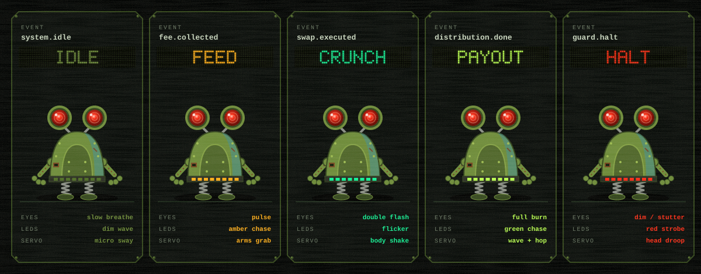

| event | emote | the body does |
|---|---|---|
| `system.boot` | **WAKE** | eyes ramp, LED sweep, stands |
| `fee.accrued` / `fee.collected` | **FEED** | eyes pulse, amber chase, arms grab |
| `route.planned` / `swap.quoted` | **ROUTE** | eye scan, 80/20 split on base, head tilt |
| `swap.executed` | **CRUNCH** | double eye flash, flicker, shake |
| `dist.completed` | **PAYOUT** | full eyes, green chase, arms wave, hop |
| `guard.halt` | **HALT** | eyes dim, red strobe, head droops. Sticky. |

Status lamp **blinks** on simulated frames, **solid** on live ones. The robot can't be fooled into looking live.


<a id="system-map"></a>

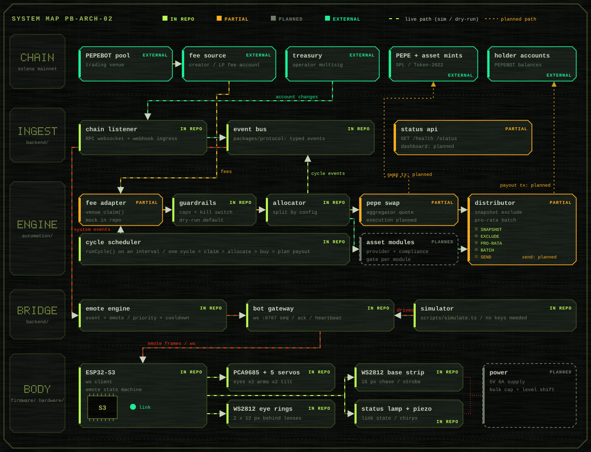

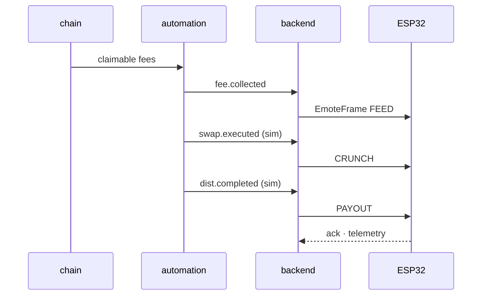

The robot holds **no keys**. The backend only observes and animates. Only `automation/` would ever
sign, and in this build it can't. → [`docs/ARCHITECTURE.md`](docs/ARCHITECTURE.md) · [`docs/EVENT-PROTOCOL.md`](docs/EVENT-PROTOCOL.md)


<a id="terminal"></a>


That is real output of `npm run sim`, replayed. Synthetic numbers, nothing signed.
Run it with `npm run dev` in another shell and a plugged-in robot reacts to the same cycle.


<a id="hardware"></a>


<details>
<summary><b>BOM + pinout</b></summary>

| part | qty | |
|---|---|---|
| ESP32-S3-DevKitC-1 | 1 | brain |
| PCA9685 PWM board | 1 | I2C `0x40` |
| micro servo (MG90S) | 5 | eye L/R, arm L/R, head |
| WS2812B 12 px ring | 2 | eyes |
| WS2812B 16 px strip | 1 | base |
| 74AHCT125 | 1 | LED level shift |
| 5V 6A PSU + 1000 µF + fuse | 1 | separate rail |

| signal | GPIO | | PCA9685 | servo |
|---|---|---|---|---|
| SDA / SCL | 8 / 9 | | CH0 / CH1 | eye stalk L / R |
| eye data | 5 | | CH2 / CH3 | arm L / R |
| base data | 6 | | CH4 | head tilt |
| status / piezo | 4 / 7 | | | |

Never power servos from the ESP32. → [`hardware/README.md`](hardware/README.md)

</details>


<a id="boot-it"></a>

```sh
git clone <this repo> && cd pepebot
npm install
cp .env.example .env              # change BOT_TOKEN / INGEST_TOKEN

npm run sim                        # one simulated cycle in the terminal
npm run dev                        # backend: http :8080, bot gateway ws :8787
BACKEND_URL=http://localhost:8080 npm run sim   # sim drives the robot

npm test && npm run typecheck
```

```sh
# the body
cd firmware/esp32
cp include/config.example.h include/config.h   # wifi, gateway host, BOT_TOKEN
pio run -t upload
```

<details>
<summary><b>repo tree</b></summary>

```
pepebot/
├─ packages/protocol/   shared events, emote frames, event→emote table
├─ backend/             event bus · chain listener · http ingest · emote engine · bot gateway
├─ automation/          cycle · fee adapters · router · swap quotes · asset modules · distributor · guards
├─ firmware/esp32/      ESP32-S3: ws client, emotes, servos, LEDs
├─ hardware/            BOM, wiring, power · cad/ (planned)
├─ contracts/           v1 uses no custom program · draft merkle distributor (not audited)
├─ config/              allocation.example.yaml
├─ scripts/             simulate.ts · readme-assets/ (generates every SVG above)
├─ docs/                architecture · event protocol · distribution · asset modules
└─ assets/              brand + readme
```

</details>


<a id="manifest"></a>

| component | path | status |
|---|---|---|
| protocol (events, emotes) | `packages/protocol` | `IN REPO` |
| event bus, http ingest, emote engine, bot gateway | `backend/` | `IN REPO` |
| treasury listener / webhook parsing | `backend/src/chain` | `PARTIAL` |
| allocation, guardrails, kill switch | `automation/` | `IN REPO` · tested |
| fee adapter | `automation/src/fees` | `PARTIAL` mock only, venue adapter needed |
| PEPE swap | `automation/src/swap` | `PARTIAL` quote only |
| spl-token asset module | `automation/src/assets` | `PARTIAL` quote only |
| tokenized-equity module | `automation/src/assets` | `GATED` no provider |
| holder snapshot + payout plan | `automation/src/distributor` | `IN REPO` · tested |
| payout sending | `automation/src/distributor` | `PLANNED` |
| simulator | `scripts/simulate.ts` | `IN REPO` |
| ESP32 firmware | `firmware/esp32` | `PARTIAL` untested on hardware |
| enclosure CAD | `hardware/cad` | `PLANNED` |
| merkle distributor program | `contracts/` | `DRAFT` not audited, not deployed |


<a id="failsafes"></a>

- **Dry-run by default.** Going live would need `dry_run: false` + `PEPEBOT_LIVE=true` + a live executor that doesn't exist yet.
- **Kill switch.** `touch KILL` → cycle halts, robot goes to sticky HALT.
- **Caps.** Per-cycle SOL cap, slippage cap, treasury reserve.
- **No keys in the repo, none in the robot.** Treasury is a multisig. → [`SECURITY.md`](SECURITY.md)
- **Verify every mint yourself.** Config ships with placeholders on purpose.
- **Not financial advice. No promised income, yield or returns.** → [`DISCLAIMER.md`](DISCLAIMER.md)

<div align="center">


<sub>every panel above is generated by <code>npm run assets</code> · MIT</sub>

</div>
