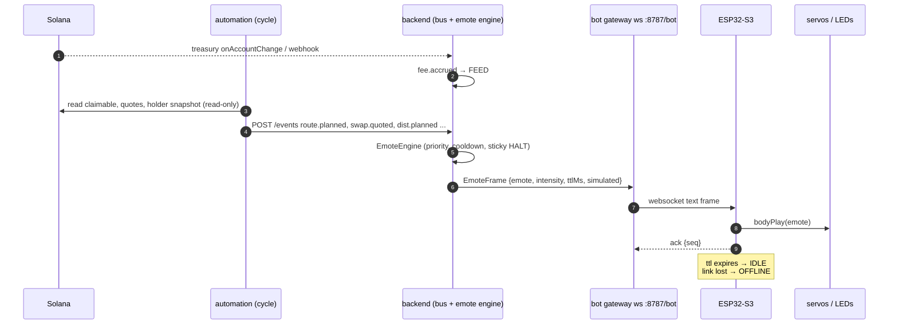

# Architecture

Four layers, one direction of authority: **money logic never depends on the robot.**
If the bot is unplugged the loop runs exactly the same. If the backend is down the bot shows OFFLINE.

| layer | path | job | status |
|---|---|---|---|
| chain | external | PEPEBOT pool, treasury, PEPE, asset mints | external |
| engine | `automation/` | fees → reserve/cap → split → quotes → asset modules → snapshot → plan → batches | dry-run built; signing/sending planned |
| ingest + bridge | `backend/` | event bus, treasury watcher, webhook ingest, emote engine, bot gateway | built |
| protocol | `packages/protocol/` | `SystemEvent`, `EmoteFrame`, event→emote table | built |
| body | `firmware/`, `hardware/` | ESP32-S3 renders emotes on servos + LEDs | draft, untested on hardware |

## Flow: chain → backend → ESP32

## Why the split

- `automation` is the only component that will ever hold signing authority (via a multisig proposal flow, planned). It runs on a schedule and is small enough to audit.
- `backend` is a read-mostly service that can be exposed to the robot on a LAN. It holds no keys.
- The ESP32 holds a bot token for the websocket and nothing else.

See [EVENT-PROTOCOL.md](EVENT-PROTOCOL.md), [DISTRIBUTION.md](DISTRIBUTION.md), [ASSET-MODULES.md](ASSET-MODULES.md).
